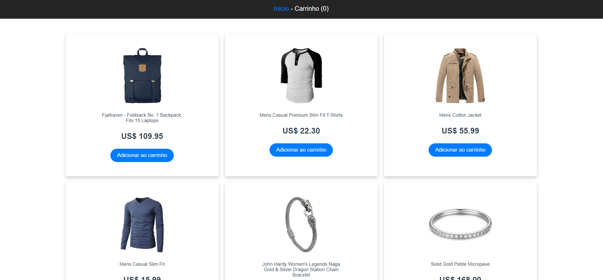
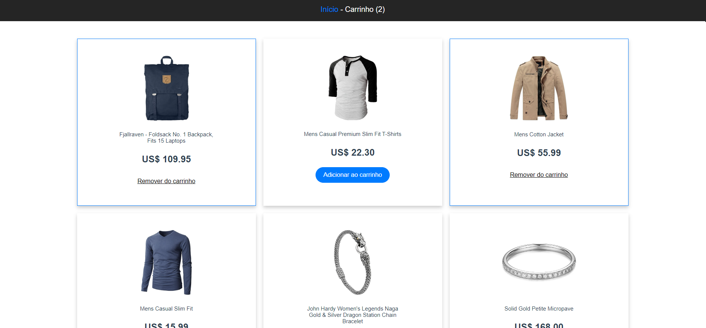
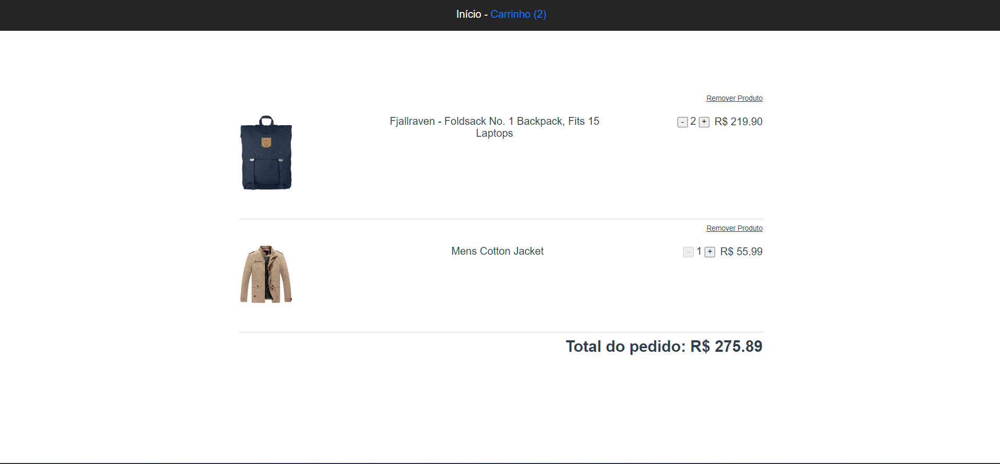
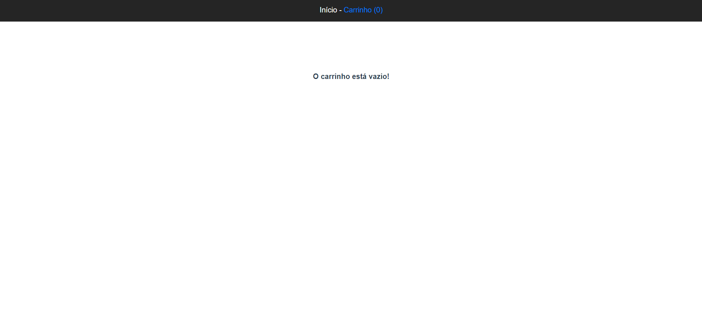

# Simple VUE.js Shopping Bag

- Aplicação compras simulando e-commerce para estudo de Vue utilizando o CLI, requisições com VueAxios e integração de componentes.
- Os produtos foram obtidos na API [Fake Store API](https://fakestoreapi.com/docs)

## Instalações

- [Node.js](https://nodejs.org/en/download)
- Yarn: **npm install -g yarn**
- Vue-CLI: **yarn global add @vue/cli**
- Axios: **yarn add axios**
- VueAxios: **yarn add vue-axios**

## Descrição

- E-commerce alimentado pela API aberta [Fake Store API](https://fakestoreapi.com/docs)
- Na página **Início** os produtos são mostrados e podem ser adicionados ou removidos do carrinho
- Na página **Carrinho** são mostrados os produtos adicionados onde suas quantidades podem ser alteradas
- Em **Carrinho** também é possível ver o total da compra
- Segue abaixo alguns screenshots da aplicação:

 

 
 

 
 

 
 

